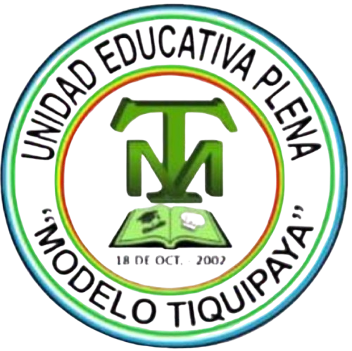

# 📚 Sistema de Gestión Académica - Unidad Educativa Modelo Tiquipaya



Sistema integral de gestión académica desarrollado en **Laravel 12** para la Unidad Educativa Modelo Tiquipaya, Bolivia. Optimiza procesos de inscripción, notificaciones y gestión de estudiantes.

---

## 🎯 Características Principales

✅ **Gestión de Estudiantes**
- Registro de estudiantes nuevos y antiguos
- Cálculo automático de edad
- Clasificación por nivel y grado
- Búsqueda y filtrado avanzado

✅ **Sistema de Inscripciones**
- Inscripción inteligente para estudiantes antiguos (Select2 AJAX)
- Estados: pendiente, aprobada, rechazada, abandono, retirado, promovido
- Documento de inscripción checklist (5 tipos)
- Seguimiento por gestión académica

✅ **Módulo de Reservas**
- Formulario público sin login para nuevos estudiantes
- Múltiples hijos por reserva
- Estados: pendiente, confirmada, cancelada
- Conversión automática a estudiantes

✅ **Sistema de Notificaciones**
- Envío por nivel educativo
- Envío por grado específico
- Notificación individual a padre/tutor
- Auto-notificación al aprobar/rechazar inscripción

✅ **Panel de Control (Dashboard)**
- Dashboard admin/secretaria
- Dashboard padre de familia
- Dashboard docente (consulta)
- Estadísticas en tiempo real

✅ **Autenticación & Roles**
- 4 roles: Admin, Secretaria, Docente, Padre
- Middleware de autorización por rol
- Contraseñas hasheadas con bcrypt

---

## 📋 Requisitos Previos

- **PHP 8.2+**
- **MySQL 8.0+**
- **Composer**
- **Node.js & npm** (opcional, para frontend)
- **Git**

---

## 🚀 Instalación Rápida

### 1. Clonar el repositorio

```bash
git clone https://github.com/Brandito777/sistema-tiquipaya.git
cd sistema-tiquipaya
```

### 2. Instalar dependencias PHP

```bash
composer install
```

### 3. Configurar archivo .env

```bash
cp .env.example .env
php artisan key:generate
```

Edita `.env` con tu configuración de base de datos:

```env
DB_CONNECTION=mysql
DB_HOST=127.0.0.1
DB_PORT=3306
DB_DATABASE=sistema_tiquipaya
DB_USERNAME=root
DB_PASSWORD=tu_contraseña
```

### 4. Crear base de datos

```bash
# Opción A: Importar BD.sql (datos de prueba incluidos)
mysql -u root -p sistema_tiquipaya < BD.sql

# Opción B: Generar desde migraciones (sin datos)
php artisan migrate
php artisan db:seed
```

### 5. Instalar dependencias Frontend (opcional)

```bash
npm install
npm run dev
```

### 6. Iniciar servidor

```bash
php artisan serve
```

Accede a: **http://localhost:8000**

---

## 🔐 Credenciales de Prueba

| Rol | Email | Contraseña |
|-----|-------|-----------|
| **Admin** | `admin@tiquipaya.edu.bo` | `123456` |
| **Secretaria** | `secretaria@tiquipaya.edu.bo` | `123456` |
| **Padre** | `padre1@example.com` | `123456` |
| **Docente** | `docente@tiquipaya.edu.bo` | `123456` |

> Nota: Estas credenciales son para desarrollo. Cámbialas en producción.

---

## 📁 Estructura del Proyecto

```
sistema-tiquipaya/
├── app/
│   ├── Http/Controllers/        # 8 Controladores CRUD
│   ├── Models/                  # 11 Modelos Eloquent
│   ├── Console/Commands/        # Comandos personalizados
│   └── Http/Middleware/         # Middleware de rol
├── database/
│   ├── migrations/              # 5 migraciones
│   └── seeders/                 # Datos de prueba
├── resources/
│   └── views/                   # 8 vistas Blade
├── routes/                      # 25+ rutas
├── tests/                       # 32 tests (11 unit + 15 feature)
├── public/                      # Assets estáticos
├── storage/                     # Logs y caché
└── BD.sql                       # Dump de BD con datos
```

---

## 🎨 Paleta de Colores Corporativos

```
Verde Primario:    #2e7d32
Verde Oscuro:      #1b5e20
Verde Claro:       #f1f8f6
Blanco:            #ffffff
Negro:             #000000
```

---

## 📊 Estadísticas Técnicas

| Métrica | Valor |
|---------|-------|
| **Controladores** | 8 |
| **Modelos** | 11 |
| **Tablas BD** | 11 |
| **Rutas** | 25+ |
| **Tests** | 32 |
| **Vistas Blade** | 20+ |

---

## 🔧 Comandos Útiles

```bash
# Ejecutar pruebas
php artisan test

# Limpiar usuarios huérfanos
php artisan limpiar:huerfanos

# Generar datos ficticios
php artisan tinker
> User::factory(10)->create(['role' => 'padre']);

# Migrar y sembrar
php artisan migrate:fresh --seed

# Compilar assets
npm run build
```

---

## 📝 API Endpoints

### Públicos (sin login)
- `GET  /reserva` - Formulario de reserva
- `POST /reserva` - Guardar reserva
- `GET  /reserva/confirmacion` - Confirmación

### Admin/Secretaria (protegidos)
- `GET  /estudiantes` - Listar estudiantes
- `GET  /inscripciones` - Listar inscripciones
- `GET  /reservas` - Ver reservas pendientes
- `GET  /padres` - Gestionar tutores
- `POST /notificaciones` - Enviar notificaciones

### Padre (protegido)
- `GET /dashboard` - Mi panel
- `GET /notificaciones` - Mis notificaciones

---

## 🐛 Solución de Problemas

### Error: "No application encryption key has been specified"
```bash
php artisan key:generate
```

### Error: "SQLSTATE[HY000]: General error"
Asegúrate de que MySQL está corriendo:
```bash
# Windows
mysql -u root -p

# Linux
sudo service mysql start
```

### Error: Clase no encontrada
```bash
composer dump-autoload
```

---

## 📧 Contacto & Soporte

**Desarrollador:** Franz Bravo Escobar  
**Email:** branditobravoescobar.com  
**Institución:** Unidad Educativa Modelo Tiquipaya  

---

## 📄 Licencia

Este proyecto está bajo licencia MIT. Ver archivo LICENSE para detalles.

---

**Última actualización:** 2 de Abril de 2026  
**Versión:** 1.0.0

## Contributing

Thank you for considering contributing to the Laravel framework! The contribution guide can be found in the [Laravel documentation](https://laravel.com/docs/contributions).

## Code of Conduct

In order to ensure that the Laravel community is welcoming to all, please review and abide by the [Code of Conduct](https://laravel.com/docs/contributions#code-of-conduct).

## Security Vulnerabilities

If you discover a security vulnerability within Laravel, please send an e-mail to Taylor Otwell via [taylor@laravel.com](mailto:taylor@laravel.com). All security vulnerabilities will be promptly addressed.

## License

The Laravel framework is open-sourced software licensed under the [MIT license](https://opensource.org/licenses/MIT).
